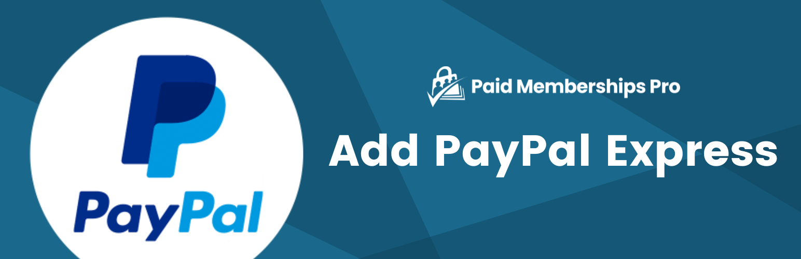

# [Add PayPal Express Option at Checkout](https://www.paidmembershipspro.com/add-ons/pmpro-add-paypal-express-option-checkout/) #
[comment]: # (Generate badges from shields.io, only works for .org plugins to get other stats etc. We'd have to create our own endpoints for Premium plugins)

### Welcome to the Add PayPal Express GitHub Repository
The Add PayPal Express Option at Checkout Add On enables a radio select on the membership checkout page. This allows a user to select their preferred payment method for purchase.

For more information please visit [www.paidmembershipspro.com/add-ons/pmpro-add-paypal-express-option-checkout/](https://www.paidmembershipspro.com/add-ons/pmpro-add-paypal-express-option-checkout/)

## Installation ##
For detailed installation steps, visit the [documentation](https://www.paidmembershipspro.com/add-ons/pmpro-add-paypal-express-option-checkout/) page.

1. Download the current development ZIP file directly: `https://github.com/strangerstudios/pmpro-add-paypal-express/archive/dev.zip`

**Please ensure that once installing this version of the plugin to remove `-dev` from the plugin's folder name.**

## Bugs ##
If you find an issue/bug, let us know by [creating a detailed GitHub issue](https://github.com/strangerstudios/pmpro-add-paypal-express/issues/new).

## Support ##
This is a developer's portal for Add PayPal Express. We do not offer support on this channel. **Any support related questions should be directed to [www.paidmembershipspro.com/add-ons/pmpro-add-paypal-express-option-checkout/](https://www.paidmembershipspro.com/add-ons/pmpro-add-paypal-express-option-checkout/).**

## Contributing to Add PayPal Express ##
We encourage and welcome any contribution to Add PayPal Express. Please read the [guidelines for contributing](https://github.com/strangerstudios/paid-memberships-pro/blob/dev/.github/CONTRIBUTING.md) to this repository.

There are various **ways to the help development** of Add PayPal Express:

1. Report [bugs/issues](https://github.com/strangerstudios/pmpro-pay-by-check/issues/new) on GitHub.
2. Work on any issues by submitting a Pull Request.

Here are some ways for **non-developers to contribute** to Add PayPal Express:

1. Translate Add PayPal Express into your own [language](https://www.paidmembershipspro.com/paid-memberships-pro-in-your-language/).
2. [Purchase a paid membership](https://paidmembershipspro.com/pricing) to help fund ongoing development and bug fixes.